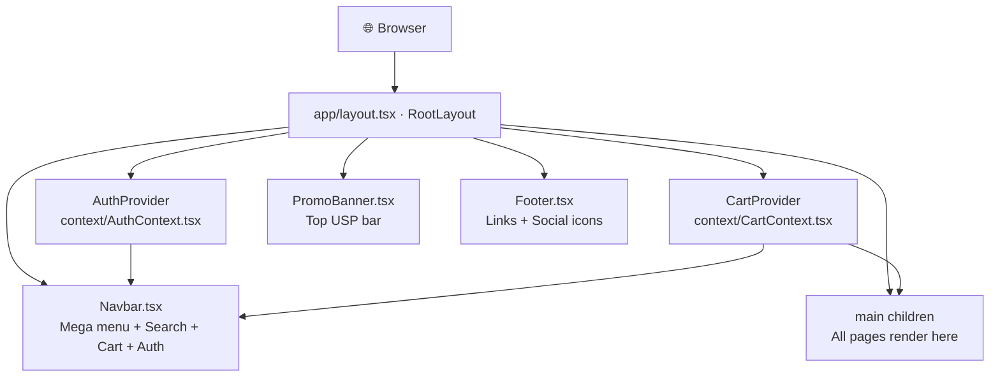
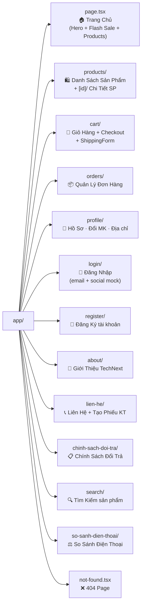
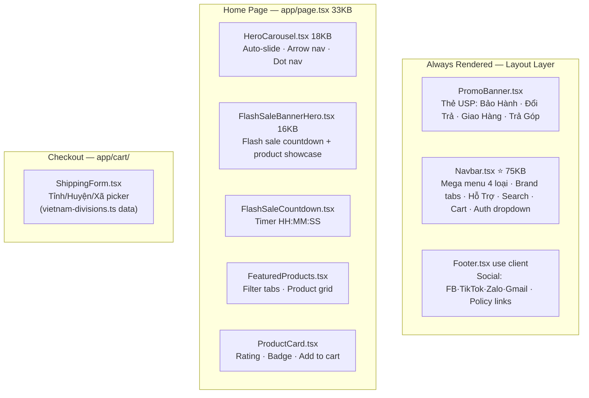
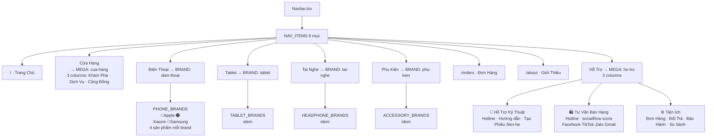
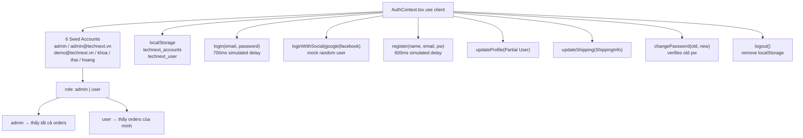
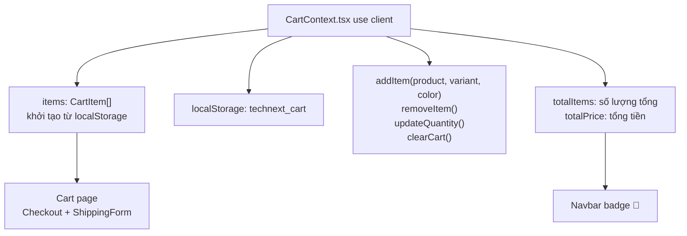
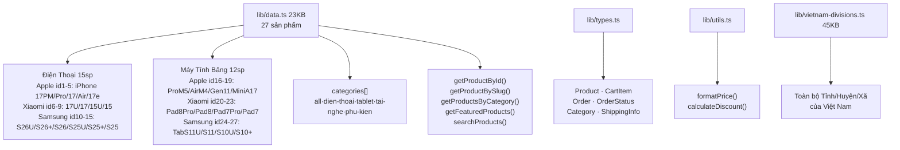
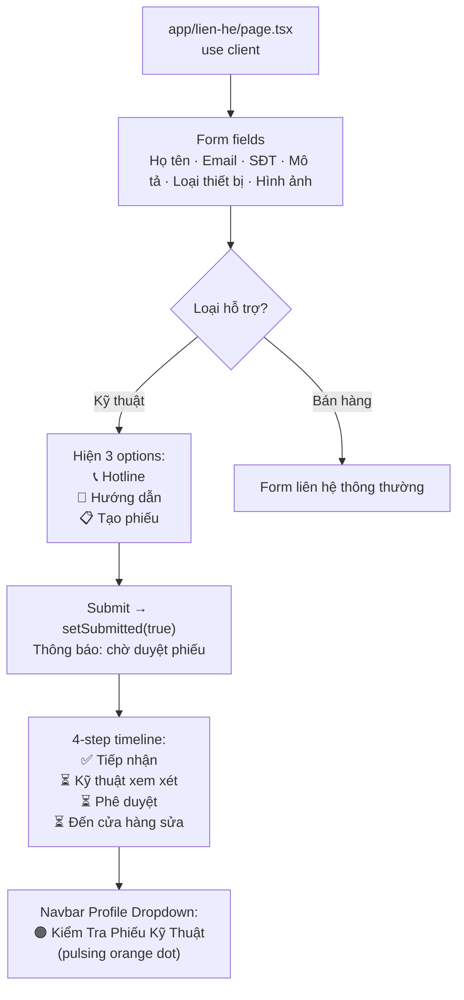
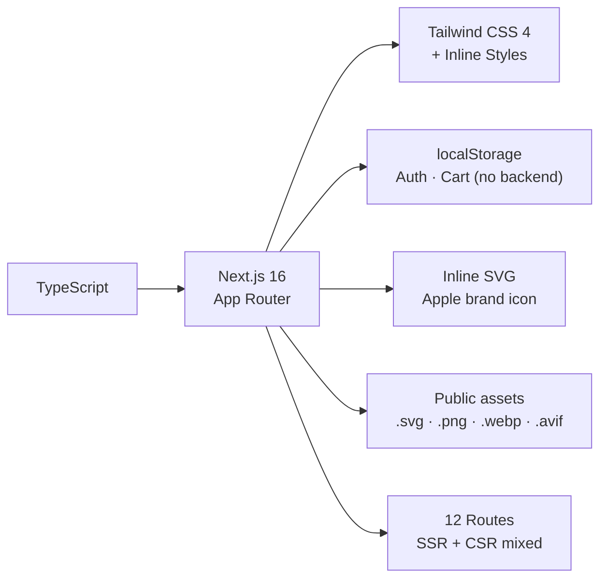

# TechNext — Project Summary Graph

> **Framework**: Next.js 16 (App Router) · **Language**: TypeScript · **Styling**: Tailwind CSS 4 + Inline Styles  
> **Storage**: localStorage (no backend) · **Phiên bản**: 2026

---

## 1. Kiến Trúc Tổng Thể

---

## 2. Cấu Trúc Pages — App Router

---

## 3. Components Map

---

## 4. Navbar — Mega Menu Chi Tiết

---

## 5. Auth System — AuthContext.tsx

---

## 6. Cart System — CartContext.tsx

---

## 7. Data Layer — lib/

---

## 8. Support Hub Flow — lien-he/

---

## 9. Public Assets

| File | Format | Dùng cho |
|---|---|---|
| `APPLE.svg` | SVG | Brand logo Apple (white path, dark bg) |
| `XIAOMI.png` | PNG | Brand logo Xiaomi (fallback "Mi" text) |
| `SAMSUNG.svg` | SVG | Brand logo Samsung (fallback "S" text) |
| `logo SAMSUNG S.jpg` | JPG | (dự phòng) |
| `facebook.webp` | WebP | Social icon Footer + Navbar |
| `tiktok.avif` | AVIF | Social icon Footer + Navbar |
| `zalo.png` | PNG | Social icon Zalo (white bg) |
| `gmail.webp` | WebP | Social icon Gmail (white bg) |
| `Google.png` | PNG | Google logo (dự phòng) |
| `videos/` | dir | Hero carousel background videos |

---

## 10. File Size Overview

| File | Size | Vai trò |
|---|---|---|
| `components/Navbar.tsx` | **75 KB** | Core mega menu, brand tabs, auth, search |
| `lib/vietnam-divisions.ts` | **45 KB** | Địa giới hành chính toàn quốc |
| `app/page.tsx` | **33 KB** | Trang chủ hoàn chỉnh |
| `lib/data.ts` | **23 KB** | 27 sản phẩm + helpers |
| `components/HeroCarousel.tsx` | **18 KB** | Carousel auto-slide |
| `components/FlashSaleBannerHero.tsx` | **16 KB** | Flash sale banner |
| `components/PromoBanner.tsx` | **9 KB** | Top promo bar |
| `components/Footer.tsx` | **9 KB** | Footer + social icons |
| `context/AuthContext.tsx` | **8 KB** | Auth state + 6 seed accounts |

---

## 11. Seed Accounts (Test Login)

| Email / Username | Password | Role |
|---|---|---|
| `admin` | `admin` | 🛡️ Admin |
| `admin@technext.vn` | `admin` | 🛡️ Admin |
| `demo@technext.vn` | `demo123` | 👤 User |
| `khoa@technext.vn` | `123456` | 👤 User |
| `thai@technext.vn` | `123456` | 👤 User |
| `hoang@technext.vn` | `123456` | 👤 User |

---

## 12. Tech Stack Summary

